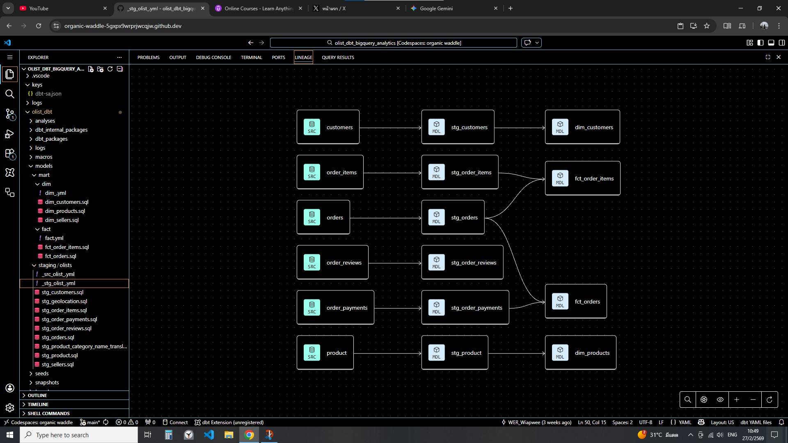
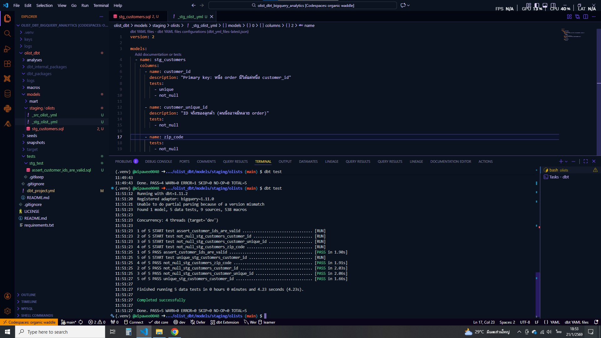
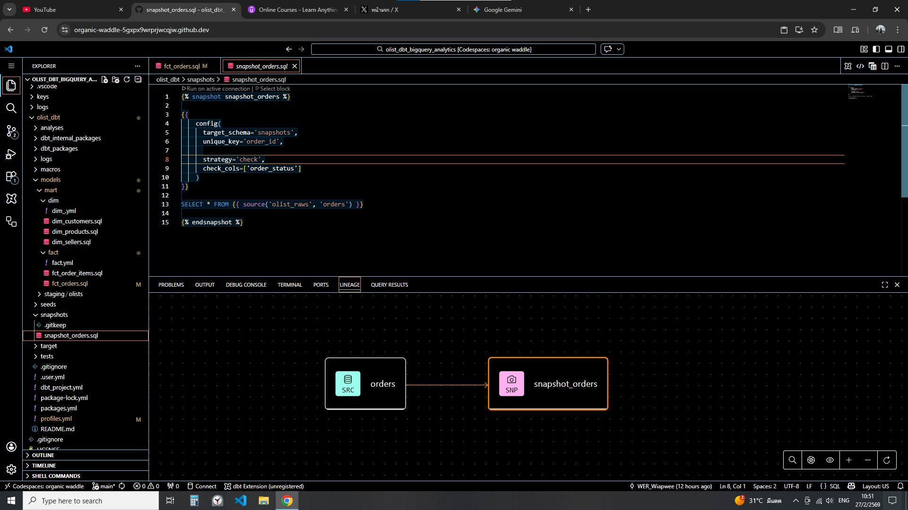
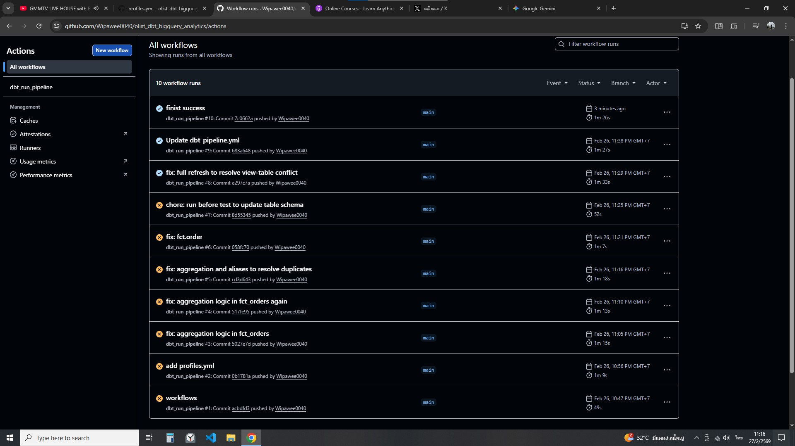

# Data Analytics Engineering Project (dbt + BigQuery)

End-to-end ELT pipeline built using **Google Cloud Platform, BigQuery, and dbt Core**.

This project demonstrates practical analytics engineering skills including data modeling, testing, snapshots, CI automation, and cloud-based development using GitHub Codespaces.

---

# 🚀 Project Overview

## Architecture Overview



*Figure 1: dbt lineage showing source → staging → mart (fact & dimension).*

This project implements a modern cloud ELT architecture:

1. Raw data stored in **Google Cloud Storage (Data Lake)**
2. Data loaded into **Google BigQuery (Data Warehouse)**
3. Transformations implemented using **dbt**
4. Final analytics tables separated into **Fact and Dimension (Mart layer)**
5. Automated validation using **dbt tests** and **GitHub Actions CI**

The goal is to build a clean, scalable, and production-style analytics pipeline following data engineering best practices.

---

# 🏗 Architecture & Implementation

### Data Flow

Data Lake (GCS) → BigQuery Raw Dataset → dbt Transformations → Mart Layer (Fact / Dimension)

### dbt Implementation Details

* **Staging Layer (`stg_`)**

  * Cleans and standardizes raw tables
  * Materialized as views

* **Mart Layer**

  * Final analytical tables
  * Split into:

    * Fact tables
    * Dimension tables
  * Materialized as tables

* **Tests (Assertions)**

## Data Quality Testing



*Custom test enforcing ID format using REGEXP validation.*

  * Implemented in `_stg_olist_.yml` and `fact.yml`
  * Uses dbt schema tests to validate data quality
  * Includes `not_null`, `unique`, and `relationships` where applicable
  * Custom validation focuses on **Regex checks for ID fields** to ensure:

    * IDs follow the expected format
    * No malformed values
    * No unexpected or invalid patterns
  * Ensures structural integrity and format consistency of key identifiers

* **Snapshots**

## Snapshots



*Snapshot configuration using `strategy='check'` to track order status changes.*

  * Used to track historical changes in selected tables
  * Enables slowly changing dimension (SCD-like) behavior when required

---

# 🗂 Project Structure

```
.
├── .devcontainer/              # GitHub Codespaces configuration
├── .github/workflows/          # CI pipeline (dbt run & test)
├── olist_dbt/
│   ├── dbt_project.yml      # Main dbt configuration file defining project name, profile ('olist_dbt'), model paths, materializations (view/table), and snapshot configuration
│   ├── models/              # Contains transformation logic written in SQL, organized into staging and mart layers (fact and dimension models)
│   ├── snapshots/           # Snapshot definitions used to capture historical changes in tables (SCD-type tracking)
│   └── tests/               # Data quality assertions (not_null, unique, relationships) defined in schema YAML files
├── requirements.txt
├── README.md
└── LICENSE
```

Notes:

* No `macros/` directory
* No `seeds/` directory
* Tests are implemented using dbt schema assertions

---

# 🧰 Tech Stack

* Google Cloud Storage (Data Lake)
* Google BigQuery (Data Warehouse)
* dbt Core (dbt-bigquery adapter)
* SQL
* GitHub Actions (CI/CD)
* GitHub Codespaces (Cloud Development Environment)

---

# 🔄 Continuous Integration (CI)

## Continuous Integration (CI)



*GitHub Actions validating dbt run & test.*

This project includes a **GitHub Actions CI workflow** to automatically validate the dbt project.

The CI pipeline performs:

* `dbt deps`
* `dbt run`
* `dbt test`

The purpose of this pipeline is to ensure that models compile successfully and pass all defined tests before changes are merged.

Note:

* This repository implements **Continuous Integration (CI)** only.
* There is no automated production deployment (CD) configured.
* No environment promotion (dev → prod) or scheduled production jobs are defined.

The CI setup focuses purely on model validation and data quality enforcement.

---

# 💻 Development Environment

Development is performed using **GitHub Codespaces**, providing:

* Cloud-based development container
* Pre-configured environment via `.devcontainer`
* Consistent setup across machines

---

# ▶ How to Run

## 1. Clone the Repository

```bash
git clone https://github.com/Wipawee0040/olist_dbt_bigquery_analytics.git
cd olist_dbt_bigquery_analytics
```

## 2. Install Dependencies

```bash
pip install -r requirements.txt
```

## 3. Configure dbt Profile

Create `~/.dbt/profiles.yml` for BigQuery connection.

## 4. Run dbt

```bash
dbt run
```

## 5. Run Tests

```bash
dbt test
```

## 6. Generate Documentation (Optional)

```bash
dbt docs generate
dbt docs serve
```

---

# 🎯 Skills Demonstrated

* Cloud-based ELT architecture design
* BigQuery data warehousing
* Dimensional modeling (Fact / Dimension)
* Data validation using dbt tests
* Snapshot-based historical tracking
* CI integration for analytics workflows
* Cloud development using GitHub Codespaces

---

This project reflects practical experience building scalable analytics pipelines using the modern data stack.

---

# ⚠️ Limitations & Future Improvements

This project represents my current learning stage in analytics engineering. While it follows modern data stack practices, it is not yet a full production-grade system.

### Current Limitations

* CI validation only (no automated production deployment)
* Single-environment configuration (no dev / staging / prod separation)
* No orchestration layer for scheduling workflows
* No advanced BigQuery optimization (partitioning / clustering)
* Data validation focuses mainly on structural and ID format checks

### Future Improvements (Learning Roadmap)

As I continue developing my data engineering skills, I aim to:

* Implement multi-environment configuration (dev → prod)
* Add controlled deployment workflow (CD)
* Introduce orchestration for scheduled runs
* Apply performance and cost optimization techniques in BigQuery
* Expand data quality checks (freshness, anomaly detection, volume validation)
* Add monitoring and alerting mechanisms

This section reflects an understanding of production requirements and a commitment to continuous improvement as a data engineer.

** Created by Wipawee Raksasat - 27/02/2026 **
